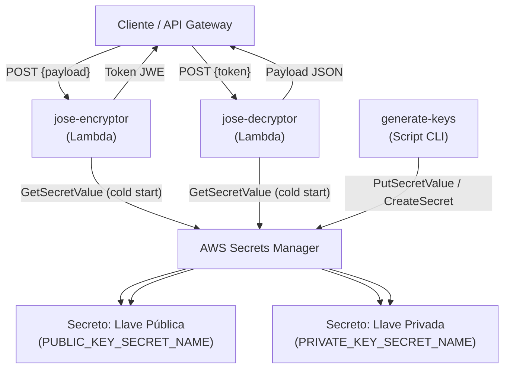
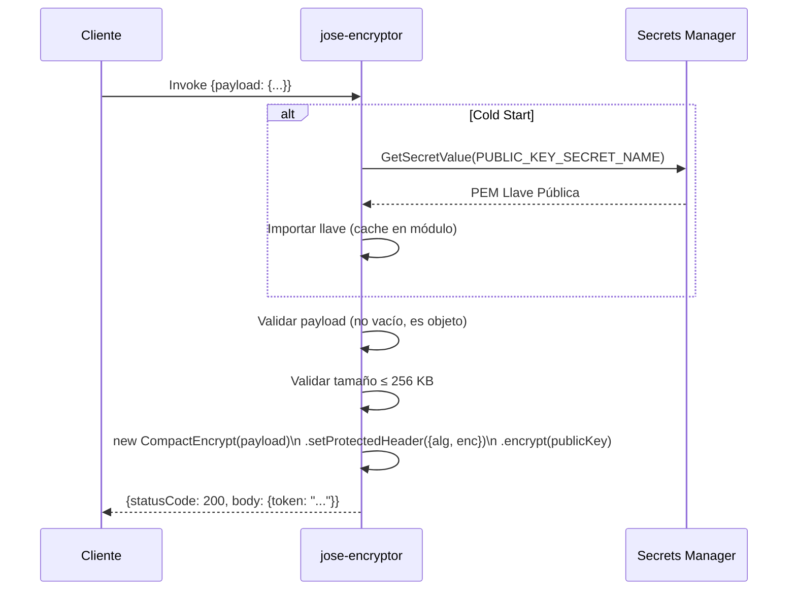
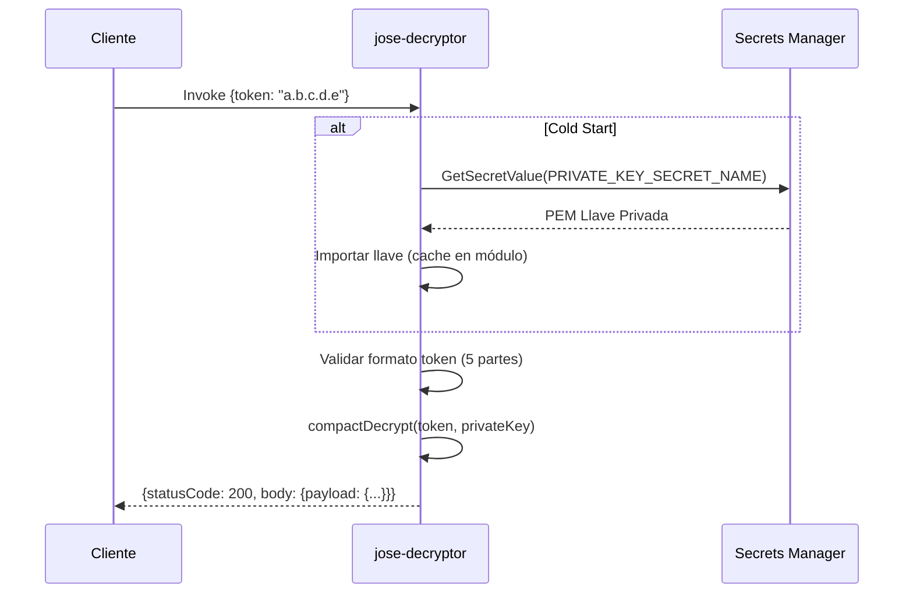

# Documento de Diseño Técnico: jwe-lambda-functions

## Overview

Este documento describe el diseño técnico de dos funciones AWS Lambda que implementan cifrado y descifrado de payloads usando el estándar **JWE (JSON Web Encryption)** con criptografía asimétrica RSA, siguiendo la metodología Spec-Driven Development (SDD).

### Componentes del Sistema

| Componente | Descripción |
|---|---|
| `jose-encryptor` | Lambda que recibe un payload JSON y retorna un Token JWE cifrado |
| `jose-decryptor` | Lambda que recibe un Token JWE y retorna el payload JSON descifrado |
| `generate-keys` | Script CLI que genera el par RSA y lo almacena en AWS Secrets Manager |
| AWS Secrets Manager | Almacén seguro para la llave pública y privada RSA en formato PEM |

### Stack Tecnológico

- **Runtime**: Node.js 20.x (LTS)
- **Librería JWE**: [`jose`](https://github.com/panva/jose) v5.x — implementación robusta de JOSE (JWA, JWE, JWS, JWT) para Node.js
- **AWS SDK**: `@aws-sdk/client-secrets-manager` v3.x
- **Testing**: Jest con mocks de AWS SDK
- **Algoritmo de cifrado de llave**: RSA-OAEP-256
- **Algoritmo de cifrado de contenido**: AES-256-GCM

### Justificación de Decisiones de Diseño

**¿Por qué `jose`?**
La librería `jose` es la implementación de referencia más utilizada para JOSE en el ecosistema Node.js. Soporta nativamente RSA-OAEP-256 + AES-256-GCM, maneja la generación de IV/CEK aleatorio automáticamente (garantizando no-determinismo), y está activamente mantenida con soporte para Web Crypto API.

**¿Por qué RSA-OAEP-256 + AES-256-GCM?**
RSA-OAEP-256 es el algoritmo asimétrico recomendado por RFC 7518 para cifrado de llaves en JWE. AES-256-GCM provee cifrado autenticado (AEAD), garantizando tanto confidencialidad como integridad del payload, lo que permite detectar tokens corrompidos o modificados.

**¿Por qué AWS Secrets Manager para las llaves?**
Secrets Manager provee rotación automática, auditoría via CloudTrail, control de acceso granular con IAM, y cifrado en reposo con KMS. Es la práctica recomendada para almacenar material criptográfico en AWS.

**Caché en memoria (warm container)**
Las llaves se recuperan de Secrets Manager en el cold start y se mantienen en el scope del módulo (fuera del handler). En invocaciones subsecuentes dentro del mismo contenedor, se reutiliza la llave cacheada, reduciendo latencia y llamadas a Secrets Manager.

---

## Architecture



### Flujo de Cifrado (jose-encryptor)



### Flujo de Descifrado (jose-decryptor)



---

## Components and Interfaces

### Estructura del Repositorio

```
lambdas_encryp_decrypt/
├── .kiro/
│   └── specs/
│       └── jwe-lambda-functions/
│           ├── requirements.md
│           ├── design.md
│           └── tasks.md
├── jose-encryptor/
│   ├── src/
│   │   ├── handler.js          # Entry point Lambda
│   │   ├── encryptor.js        # Lógica de cifrado JWE
│   │   └── secretsManager.js   # Cliente AWS Secrets Manager
│   ├── tests/
│   │   └── handler.test.js     # Pruebas unitarias con mocks
│   ├── package.json
│   └── README.md
├── jose-decryptor/
│   ├── src/
│   │   ├── handler.js          # Entry point Lambda
│   │   ├── decryptor.js        # Lógica de descifrado JWE
│   │   └── secretsManager.js   # Cliente AWS Secrets Manager
│   ├── tests/
│   │   └── handler.test.js     # Pruebas unitarias con mocks
│   ├── package.json
│   └── README.md
└── scripts/
    ├── generate-keys.js        # Script CLI generación de par RSA
    └── package.json
```

### Interfaz del Handler: jose-encryptor

**Evento de entrada:**
```json
{
  "payload": {
    "userId": "123",
    "data": "sensitive information"
  }
}
```

**Respuesta exitosa (HTTP 200):**
```json
{
  "statusCode": 200,
  "body": "{\"token\": \"eyJhbGciOiJSU0EtT0FFUC0yNTYiLCJlbmMiOiJBMjU2R0NNIn0.abc.def.ghi.jkl\"}"
}
```

**Respuestas de error:**
| Código | Condición | Mensaje |
|---|---|---|
| 400 | Campo `payload` ausente | `"Missing required field: payload"` |
| 400 | `payload` vacío `{}`, no-objeto, o inválido | `"Invalid payload: must be a non-empty valid JSON object"` |
| 400 | Payload > 256 KB | `"Payload too large: maximum size is 256KB"` |
| 500 | Fallo al recuperar llave pública | `"Failed to retrieve encryption key"` |
| 500 | Fallo en proceso de cifrado | `"Encryption failed"` |

### Interfaz del Handler: jose-decryptor

**Evento de entrada:**
```json
{
  "token": "eyJhbGciOiJSU0EtT0FFUC0yNTYiLCJlbmMiOiJBMjU2R0NNIn0.abc.def.ghi.jkl"
}
```

**Respuesta exitosa (HTTP 200):**
```json
{
  "statusCode": 200,
  "body": "{\"payload\": {\"userId\": \"123\", \"data\": \"sensitive information\"}}"
}
```

**Respuestas de error:**
| Código | Condición | Mensaje |
|---|---|---|
| 400 | Campo `token` ausente | `"Missing required field: token"` |
| 400 | Formato JWE inválido (≠ 5 partes) o algoritmos incorrectos | `"Invalid token format: must be a valid JWE Compact Serialization"` |
| 422 | Llave privada no corresponde al token | `"Decryption failed: key mismatch"` |
| 422 | Token corrompido (fallo integridad AES-GCM) | `"Decryption failed: token integrity check failed"` |
| 500 | Fallo al recuperar llave privada | `"Failed to retrieve decryption key"` |
| 500 | Fallo de descifrado por otra causa | `"Decryption failed"` |

### Módulo: secretsManager.js (compartido por ambas lambdas)

```javascript
// Interfaz del módulo
async function getSecret(secretName: string): Promise<string>
```

Responsabilidades:
- Instanciar `SecretsManagerClient` con la región de `AWS_REGION`
- Ejecutar `GetSecretValueCommand`
- Retornar el valor del secreto como string (PEM)
- Propagar errores para que el handler los capture

### Módulo: encryptor.js

```javascript
// Interfaz del módulo
async function encryptPayload(payload: object, publicKeyPem: string): Promise<string>
```

Responsabilidades:
- Importar la llave pública PEM con `jose.importSPKI(pem, 'RSA-OAEP-256')`
- Serializar el payload a `Uint8Array` via `TextEncoder`
- Construir y ejecutar `new CompactEncrypt(plaintext).setProtectedHeader({alg: 'RSA-OAEP-256', enc: 'A256GCM'}).encrypt(publicKey)`
- Retornar el token JWE como string

### Módulo: decryptor.js

```javascript
// Interfaz del módulo
async function decryptToken(token: string, privateKeyPem: string): Promise<object>
```

Responsabilidades:
- Importar la llave privada PEM con `jose.importPKCS8(pem, 'RSA-OAEP-256')`
- Ejecutar `compactDecrypt(token, privateKey)`
- Decodificar el plaintext con `TextDecoder` y parsear como JSON
- Propagar errores diferenciados (key mismatch vs. integrity failure vs. otros)

### Script: generate-keys.js

```javascript
// Flujo principal
async function main(): Promise<void>
```

Responsabilidades:
1. Generar par RSA 2048-bit con `crypto.generateKeyPair('rsa', { modulusLength: 2048 })`
2. Exportar llave pública en formato SPKI PEM
3. Exportar llave privada en formato PKCS8 PEM
4. Leer `PUBLIC_KEY_SECRET_NAME` y `PRIVATE_KEY_SECRET_NAME` de variables de entorno
5. Almacenar/sobreescribir cada llave en Secrets Manager (CreateSecret o UpdateSecret)
6. Emitir mensajes de éxito/error y terminar con código de salida apropiado

---

## Data Models

### Estructura del Token JWE (JWE Compact Serialization)

```
BASE64URL(JWE Protected Header) . BASE64URL(JWE Encrypted Key) . BASE64URL(JWE Initialization Vector) . BASE64URL(JWE Ciphertext) . BASE64URL(JWE Authentication Tag)
```

**JWE Protected Header decodificado:**
```json
{
  "alg": "RSA-OAEP-256",
  "enc": "A256GCM"
}
```

### Modelo de Secreto en AWS Secrets Manager

| Secreto | Variable de Entorno | Tipo | Formato |
|---|---|---|---|
| Llave Pública RSA | `PUBLIC_KEY_SECRET_NAME` | `SecretString` | PEM (SPKI) |
| Llave Privada RSA | `PRIVATE_KEY_SECRET_NAME` | `SecretString` | PEM (PKCS8) |

**Ejemplo de valor PEM (llave pública):**
```
-----BEGIN PUBLIC KEY-----
MIIBIjANBgkqhkiG9w0BAQEFAAOCAQ8AMIIBCgKCAQEA...
-----END PUBLIC KEY-----
```

### Variables de Entorno por Lambda

**jose-encryptor:**
| Variable | Descripción | Ejemplo |
|---|---|---|
| `PUBLIC_KEY_SECRET_NAME` | Nombre del secreto en Secrets Manager | `jwe/public-key` |
| `AWS_REGION` | Región AWS | `us-east-1` |

**jose-decryptor:**
| Variable | Descripción | Ejemplo |
|---|---|---|
| `PRIVATE_KEY_SECRET_NAME` | Nombre del secreto en Secrets Manager | `jwe/private-key` |
| `AWS_REGION` | Región AWS | `us-east-1` |

### Modelo de Caché en Memoria

```javascript
// Scope de módulo (fuera del handler) — persiste entre invocaciones warm
let cachedPublicKey = null;   // jose-encryptor
let cachedPrivateKey = null;  // jose-decryptor
```

El patrón de inicialización lazy garantiza que la llave se recupera exactamente una vez por contenedor de ejecución:

```javascript
async function getKey() {
  if (!cachedKey) {
    const pem = await getSecret(process.env.KEY_SECRET_NAME);
    cachedKey = await importKey(pem);
  }
  return cachedKey;
}
```

### Estructura de Respuesta Lambda (API Gateway Proxy Integration)

```javascript
{
  statusCode: number,          // 200 | 400 | 422 | 500
  headers: {
    'Content-Type': 'application/json'
  },
  body: string                 // JSON.stringify({token: ...} | {payload: ...} | {error: ...})
}
```

---

## Correctness Properties

*Una propiedad es una característica o comportamiento que debe mantenerse verdadero en todas las ejecuciones válidas de un sistema — esencialmente, una declaración formal sobre lo que el sistema debe hacer. Las propiedades sirven como puente entre las especificaciones legibles por humanos y las garantías de corrección verificables por máquinas.*

### Property 1: Round-Trip con Preservación de Tipos

*Para cualquier* objeto JSON válido y no vacío (incluyendo payloads con strings Unicode, números de punto flotante, arrays anidados y objetos con hasta 10 niveles de profundidad), cifrarlo con la llave pública RSA activa y luego descifrarlo con la llave privada correspondiente del mismo par RSA debe producir un objeto con exactamente los mismos campos, valores y tipos de dato que el payload original (igualdad profunda).

**Validates: Requirements 3.1, 4.1, 4.2, 4.4**

### Property 2: Algoritmos Declarados en el Header JWE

*Para cualquier* payload JSON válido y no vacío, el token JWE producido por la Lambda_Encriptador debe tener en su header protegido (primera parte, decodificada en base64url) exactamente `"alg": "RSA-OAEP-256"` y `"enc": "A256GCM"`, y el token debe estar compuesto por exactamente 5 partes separadas por puntos.

**Validates: Requirements 2.1, 2.2, 2.3**

### Property 3: No-Determinismo del Token JWE

*Para cualquier* payload JSON válido y no vacío cifrado dos veces consecutivas con el mismo par RSA, los dos tokens JWE resultantes deben diferir en al menos una de sus 5 partes (garantizado por IV/CEK aleatorio), y ambos tokens deben poder ser descifrados correctamente retornando el payload original con igualdad profunda.

**Validates: Requirements 4.3**

### Property 4: Rechazo de Payloads Inválidos

*Para cualquier* valor que no sea un objeto JSON no vacío — incluyendo strings, números, booleanos, null, arrays, y el objeto vacío `{}` — la Lambda_Encriptador debe rechazarlo con HTTP 400 sin producir ningún token.

**Validates: Requirements 2.5, 2.6**

### Property 5: Límite de Tamaño del Payload

*Para cualquier* objeto JSON cuyo tamaño serializado supere 256 KB, la Lambda_Encriptador debe rechazarlo con HTTP 400 con el mensaje `"Payload too large: maximum size is 256KB"`, independientemente del contenido del objeto.

**Validates: Requirements 2.10**

### Property 6: Rechazo de Tokens con Formato Inválido

*Para cualquier* string que no tenga exactamente 5 partes separadas por puntos (`.`), la Lambda_Desencriptador debe rechazarlo con HTTP 400 con el mensaje `"Invalid token format: must be a valid JWE Compact Serialization"`.

**Validates: Requirements 3.6**

### Property 7: Detección de Tokens Corrompidos

*Para cualquier* token JWE válido que haya sido modificado en cualquiera de sus partes (ciphertext o authentication tag alterados), la Lambda_Desencriptador debe retornar HTTP 422 con un mensaje de error de integridad, sin revelar el contenido del payload.

**Validates: Requirements 3.9**

---

## Error Handling

### Estrategia de Clasificación de Errores

Los errores se clasifican en tres categorías según su origen y naturaleza:

```
Errores de Validación (4xx) — Responsabilidad del cliente
├── 400: Payload/token ausente, formato inválido, tamaño excedido
└── 422: Fallo de integridad o mismatch de llave (token semánticamente inválido)

Errores de Infraestructura (5xx) — Responsabilidad del sistema
├── 500: Fallo en Secrets Manager (permisos, red, secreto no encontrado)
└── 500: Fallo inesperado en cifrado/descifrado
```

### Manejo de Errores en jose-encryptor

```javascript
exports.handler = async (event) => {
  try {
    // 1. Validación de entrada
    if (!event.payload) return error(400, 'Missing required field: payload');
    if (!isValidPayload(event.payload)) return error(400, 'Invalid payload: must be a non-empty valid JSON object');
    if (isOversized(event.payload)) return error(400, 'Payload too large: maximum size is 256KB');

    // 2. Recuperación de llave (con caché)
    let publicKey;
    try {
      publicKey = await getCachedPublicKey();
    } catch (e) {
      return error(500, 'Failed to retrieve encryption key');
    }

    // 3. Cifrado
    try {
      const token = await encryptPayload(event.payload, publicKey);
      return success({ token });
    } catch (e) {
      return error(500, 'Encryption failed');
    }
  } catch (e) {
    return error(500, 'Encryption failed');
  }
};
```

### Manejo de Errores en jose-decryptor

La librería `jose` lanza errores tipados que permiten distinguir entre:
- `JWEDecryptionFailed` — fallo de integridad AES-GCM o llave incorrecta
- `JWEInvalid` — formato de token inválido
- Otros errores — fallo genérico

```javascript
exports.handler = async (event) => {
  try {
    // 1. Validación de entrada
    if (!event.token) return error(400, 'Missing required field: token');
    if (!isValidJWEFormat(event.token)) return error(400, 'Invalid token format: must be a valid JWE Compact Serialization');

    // 2. Recuperación de llave (con caché)
    let privateKey;
    try {
      privateKey = await getCachedPrivateKey();
    } catch (e) {
      return error(500, 'Failed to retrieve decryption key');
    }

    // 3. Descifrado con manejo diferenciado
    try {
      const payload = await decryptToken(event.token, privateKey);
      return success({ payload });
    } catch (e) {
      if (isKeyMismatch(e)) return error(422, 'Decryption failed: key mismatch');
      if (isIntegrityFailure(e)) return error(422, 'Decryption failed: token integrity check failed');
      return error(500, 'Decryption failed');
    }
  } catch (e) {
    return error(500, 'Decryption failed');
  }
};
```

### Detección de Errores jose Específicos

La librería `jose` expone errores con la propiedad `code`:
- `ERR_JWE_DECRYPTION_FAILED` → HTTP 422 (key mismatch o integridad)
- `ERR_JWE_INVALID` → HTTP 400 (formato inválido)

Para distinguir key mismatch de integrity failure, se analiza el mensaje del error o se intenta la validación del header antes del descifrado.

### Manejo de Errores en generate-keys.js

```javascript
// Errores de generación criptográfica → exit(1) + mensaje identificando etapa
// Errores de Secrets Manager → exit(1) + nombre del secreto + causa AWS
// Éxito → exit(0) + confirmación de almacenamiento
```

---

## Testing Strategy

### Enfoque Dual: Pruebas Unitarias + Pruebas de Propiedades

Las pruebas se organizan en dos capas complementarias:

1. **Pruebas unitarias (Jest)**: Verifican comportamientos específicos, casos de error concretos, y la integración entre módulos con mocks de AWS.
2. **Pruebas de propiedades (fast-check + Jest)**: Verifican propiedades universales sobre el espacio de inputs, ejecutando mínimo 100 iteraciones por propiedad.

### Pruebas Unitarias (Jest)

**jose-encryptor — casos cubiertos:**
- ✅ Payload válido → HTTP 200 con token de 5 partes
- ✅ Evento sin campo `payload` → HTTP 400
- ✅ `payload` es string → HTTP 400
- ✅ `payload` es número → HTTP 400
- ✅ `payload` es array → HTTP 400
- ✅ `payload` es null → HTTP 400
- ✅ `payload` es `{}` → HTTP 400
- ✅ Payload > 256 KB → HTTP 400
- ✅ Fallo simulado en Secrets Manager → HTTP 500

**jose-decryptor — casos cubiertos:**
- ✅ Token JWE válido → HTTP 200 con payload original (deep equal)
- ✅ Evento sin campo `token` → HTTP 400
- ✅ Token con 4 partes → HTTP 400
- ✅ Token con 6 partes → HTTP 400
- ✅ Token cifrado con llave diferente → HTTP 422
- ✅ Token corrompido → HTTP 422
- ✅ Fallo simulado en Secrets Manager → HTTP 500

**Estrategia de mocking:**
```javascript
// jest.mock para @aws-sdk/client-secrets-manager
jest.mock('@aws-sdk/client-secrets-manager', () => ({
  SecretsManagerClient: jest.fn().mockImplementation(() => ({
    send: jest.fn().mockResolvedValue({ SecretString: mockPemKey })
  })),
  GetSecretValueCommand: jest.fn()
}));
```

### Pruebas de Propiedades (fast-check)

La librería `fast-check` es la elección estándar para property-based testing en el ecosistema JavaScript/TypeScript. Genera inputs aleatorios y ejecuta cada propiedad mínimo 100 veces.

**Configuración:**
```javascript
import fc from 'fast-check';

// Mínimo 100 iteraciones por propiedad
fc.configureGlobal({ numRuns: 100 });
```

**Generadores de datos:**

```javascript
// Generador de payload JSON válido y no vacío
const validPayloadArb = fc.record({
  // Al menos un campo requerido
  id: fc.string(),
  value: fc.oneof(fc.string(), fc.integer(), fc.boolean(), fc.constant(null))
}, { withDeletedKeys: false });

// Generador de payload con tipos mixtos
const richPayloadArb = fc.dictionary(
  fc.string({ minLength: 1 }),
  fc.jsonValue()  // string, number, boolean, null, array, nested object
);

// Generador de payload con Unicode y floats
const unicodePayloadArb = fc.record({
  text: fc.fullUnicodeString(),
  num: fc.float({ noNaN: true }),
  nested: fc.record({ deep: fc.string() })
});
```

**Implementación de propiedades:**

```javascript
// Feature: jwe-lambda-functions, Property 1: Round-trip con preservación de tipos
test('Property 1: Round-trip preserva payload original con todos los tipos de dato', async () => {
  // Generador rico: Unicode, floats, arrays anidados, objetos hasta 10 niveles
  const deepPayloadArb = fc.dictionary(
    fc.string({ minLength: 1 }),
    fc.oneof(
      fc.fullUnicodeString(),
      fc.float({ noNaN: true }),
      fc.boolean(),
      fc.constant(null),
      fc.array(fc.jsonValue(), { maxLength: 5 }),
      fc.dictionary(fc.string({ minLength: 1 }), fc.jsonValue(), { maxKeys: 3 })
    ),
    { minKeys: 1, maxKeys: 10 }
  );
  await fc.assert(
    fc.asyncProperty(deepPayloadArb, async (payload) => {
      const encryptResult = await handler_encryptor({ payload });
      expect(encryptResult.statusCode).toBe(200);
      const { token } = JSON.parse(encryptResult.body);
      const decryptResult = await handler_decryptor({ token });
      expect(decryptResult.statusCode).toBe(200);
      const { payload: recovered } = JSON.parse(decryptResult.body);
      expect(recovered).toEqual(payload);
    }),
    { numRuns: 100 }
  );
});

// Feature: jwe-lambda-functions, Property 2: Algoritmos declarados en el header JWE
test('Property 2: Token JWE declara algoritmos correctos y tiene 5 partes', async () => {
  await fc.assert(
    fc.asyncProperty(validPayloadArb, async (payload) => {
      const result = await handler_encryptor({ payload });
      expect(result.statusCode).toBe(200);
      const { token } = JSON.parse(result.body);
      const parts = token.split('.');
      expect(parts).toHaveLength(5);
      const header = JSON.parse(Buffer.from(parts[0], 'base64url').toString('utf8'));
      expect(header.alg).toBe('RSA-OAEP-256');
      expect(header.enc).toBe('A256GCM');
    }),
    { numRuns: 100 }
  );
});

// Feature: jwe-lambda-functions, Property 3: No-determinismo del token JWE
test('Property 3: Dos cifrados del mismo payload producen tokens distintos y ambos descifrables', async () => {
  await fc.assert(
    fc.asyncProperty(validPayloadArb, async (payload) => {
      const result1 = await handler_encryptor({ payload });
      const result2 = await handler_encryptor({ payload });
      const token1 = JSON.parse(result1.body).token;
      const token2 = JSON.parse(result2.body).token;
      expect(token1).not.toBe(token2);
      const dec1 = await handler_decryptor({ token: token1 });
      const dec2 = await handler_decryptor({ token: token2 });
      expect(JSON.parse(dec1.body).payload).toEqual(payload);
      expect(JSON.parse(dec2.body).payload).toEqual(payload);
    }),
    { numRuns: 100 }
  );
});

// Feature: jwe-lambda-functions, Property 4: Rechazo de payloads inválidos
test('Property 4: Valores no-objeto o vacíos son rechazados con HTTP 400', async () => {
  const invalidArb = fc.oneof(
    fc.string(),
    fc.integer(),
    fc.float(),
    fc.boolean(),
    fc.constant(null),
    fc.array(fc.anything()),
    fc.constant({})
  );
  await fc.assert(
    fc.asyncProperty(invalidArb, async (invalidPayload) => {
      const result = await handler_encryptor({ payload: invalidPayload });
      expect(result.statusCode).toBe(400);
    }),
    { numRuns: 100 }
  );
});

// Feature: jwe-lambda-functions, Property 5: Límite de tamaño del payload
test('Property 5: Payloads mayores a 256KB son rechazados con HTTP 400', async () => {
  // Generar payloads que superen 256KB
  const oversizedArb = fc.string({ minLength: 300000 }).map(s => ({ data: s }));
  await fc.assert(
    fc.asyncProperty(oversizedArb, async (payload) => {
      const result = await handler_encryptor({ payload });
      expect(result.statusCode).toBe(400);
      expect(JSON.parse(result.body).error).toContain('Payload too large');
    }),
    { numRuns: 20 } // Menos iteraciones por el tamaño de los datos
  );
});

// Feature: jwe-lambda-functions, Property 6: Rechazo de tokens con formato inválido
test('Property 6: Strings con número incorrecto de partes son rechazados con HTTP 400', async () => {
  // Generar strings con 1-4 o 6+ partes separadas por puntos
  const wrongPartsArb = fc.oneof(
    fc.array(fc.base64String(), { minLength: 1, maxLength: 4 }).map(parts => parts.join('.')),
    fc.array(fc.base64String(), { minLength: 6, maxLength: 10 }).map(parts => parts.join('.'))
  );
  await fc.assert(
    fc.asyncProperty(wrongPartsArb, async (token) => {
      const result = await handler_decryptor({ token });
      expect(result.statusCode).toBe(400);
    }),
    { numRuns: 100 }
  );
});

// Feature: jwe-lambda-functions, Property 7: Detección de tokens corrompidos
test('Property 7: Tokens con ciphertext corrompido retornan HTTP 422', async () => {
  await fc.assert(
    fc.asyncProperty(validPayloadArb, async (payload) => {
      const encryptResult = await handler_encryptor({ payload });
      const { token } = JSON.parse(encryptResult.body);
      const parts = token.split('.');
      // Corromper el ciphertext (parte 3, índice 3)
      const corruptedCiphertext = parts[3].split('').reverse().join('');
      const corruptedToken = [parts[0], parts[1], parts[2], corruptedCiphertext, parts[4]].join('.');
      const result = await handler_decryptor({ token: corruptedToken });
      expect(result.statusCode).toBe(422);
    }),
    { numRuns: 100 }
  );
});
```

### Dependencias de Desarrollo

**jose-encryptor/package.json y jose-decryptor/package.json:**
```json
{
  "devDependencies": {
    "jest": "^29.0.0",
    "fast-check": "^3.0.0"
  },
  "dependencies": {
    "jose": "^5.0.0",
    "@aws-sdk/client-secrets-manager": "^3.0.0"
  }
}
```

### Comandos de Prueba

```bash
# Instalar dependencias
npm install

# Ejecutar todas las pruebas (unitarias + propiedades)
npm test

# Ejecutar en modo single-run (sin watch)
npx jest --runInBand
```

### Criterios de Completitud de Pruebas

- Todas las pruebas unitarias de los Requerimientos 5.1–5.4 deben pasar
- Las 4 propiedades de fast-check deben pasar con 100 iteraciones cada una
- Tiempo total de ejecución < 60 segundos
- Sin dependencias de conectividad real a AWS (todo mockeado)
