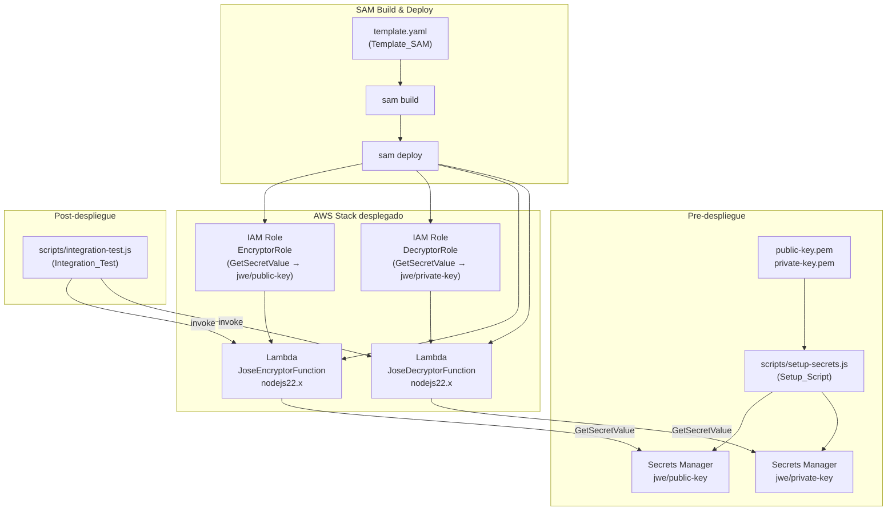

# Documento de Diseño: Despliegue JWE Lambda Functions con AWS SAM

## Overview

Este documento describe el diseño técnico para desplegar las funciones Lambda `jose-encryptor` y `jose-decryptor` en AWS usando AWS SAM. El proyecto ya cuenta con el código de las Lambdas completamente implementado y testeado; el trabajo consiste en crear la infraestructura como código (IaC), automatizar la gestión de secretos RSA en AWS Secrets Manager y proveer scripts de verificación post-despliegue.

El diseño sigue el principio de mínimo privilegio para IAM, usa parámetros SAM para hacer la configuración flexible, y provee un script de setup y uno de prueba de integración para automatizar el ciclo completo.

---

## Architecture



**Flujo de trabajo completo:**
1. Ejecutar `setup-secrets.js` para subir las claves PEM a Secrets Manager
2. Ejecutar `sam build` para empaquetar las Lambdas
3. Ejecutar `sam deploy` para crear/actualizar el stack CloudFormation
4. Ejecutar `integration-test.js` para verificar el funcionamiento end-to-end

---

## Components and Interfaces

### 1. `template.yaml` (Template_SAM)

Archivo principal de infraestructura SAM. Define todos los recursos AWS.

**Parámetros:**
| Parámetro | Tipo | Default | Descripción |
|-----------|------|---------|-------------|
| `PublicKeySecretName` | String | `jwe/public-key` | Nombre del secreto en Secrets Manager para la clave pública RSA |
| `PrivateKeySecretName` | String | `jwe/private-key` | Nombre del secreto en Secrets Manager para la clave privada RSA |
| `Environment` | String | `dev` | Entorno de despliegue (dev/staging/prod) |

**Recursos:**
- `JoseEncryptorFunction` — AWS::Serverless::Function
- `JoseDecryptorFunction` — AWS::Serverless::Function
- `EncryptorRole` — AWS::IAM::Role (creado implícitamente por SAM con políticas inline)
- `DecryptorRole` — AWS::IAM::Role (creado implícitamente por SAM con políticas inline)

**Outputs:**
- `JoseEncryptorFunctionArn` — ARN de la función encriptadora
- `JoseDecryptorFunctionArn` — ARN de la función desencriptadora

### 2. `samconfig.toml`

Archivo de configuración para `sam deploy`. Evita tener que pasar flags en cada despliegue.

**Secciones:**
- `[default.deploy.parameters]` — configuración por defecto para el entorno de desarrollo

### 3. `scripts/setup-secrets.js` (Setup_Script)

Script Node.js que lee los archivos PEM y los sube a AWS Secrets Manager.

**Interfaz de línea de comandos:**
```
node scripts/setup-secrets.js [--public-key-name <nombre>] [--private-key-name <nombre>] [--region <región>]
```

**Variables de entorno alternativas:**
- `PUBLIC_KEY_SECRET_NAME` (default: `jwe/public-key`)
- `PRIVATE_KEY_SECRET_NAME` (default: `jwe/private-key`)
- `AWS_REGION` (default: `us-east-1`)

**Lógica de upsert:**
```
para cada clave (pública, privada):
  1. Leer archivo PEM (falla inmediata si no existe)
  2. Intentar CreateSecret
     - Si ResourceExistsException → llamar UpdateSecretValue
     - Si otro error → mostrar error y salir con código != 0
  3. Mostrar ARN del secreto creado/actualizado
```

**Dependencias:** `@aws-sdk/client-secrets-manager`, `fs`, `path`, `process`

### 4. `scripts/integration-test.js` (Integration_Test)

Script Node.js que verifica el flujo completo post-despliegue usando el AWS SDK.

**Interfaz de línea de comandos:**
```
node scripts/integration-test.js [--stack-name <nombre>] [--region <región>]
```

**Variables de entorno alternativas:**
- `STACK_NAME` (default: `jwe-lambda-functions`)
- `AWS_REGION` (default: `us-east-1`)

**Flujo de prueba:**
```
1. Derivar nombres de funciones desde el stack name
2. Invocar JoseEncryptorFunction con payload de prueba
3. Verificar statusCode == 200 y formato JWE del token (5 partes)
4. Si token inválido → mostrar error y salir con código != 0
5. Invocar JoseDecryptorFunction con el token obtenido
6. Verificar statusCode == 200 y equivalencia del payload
7. Mostrar mensaje de éxito
```

**Dependencias:** `@aws-sdk/client-lambda`, `@aws-sdk/client-cloudformation`

---

## Data Models

### Evento de invocación — JoseEncryptorFunction
```json
{
  "payload": {
    "campo1": "valor1",
    "campo2": 123
  }
}
```

### Respuesta — JoseEncryptorFunction (éxito)
```json
{
  "statusCode": 200,
  "headers": { "Content-Type": "application/json" },
  "body": "{\"token\": \"eyJ....<base64url>....<base64url>....<base64url>....<base64url>\"}"
}
```

### Evento de invocación — JoseDecryptorFunction
```json
{
  "token": "eyJ....<base64url>....<base64url>....<base64url>....<base64url>"
}
```

### Respuesta — JoseDecryptorFunction (éxito)
```json
{
  "statusCode": 200,
  "headers": { "Content-Type": "application/json" },
  "body": "{\"payload\": {\"campo1\": \"valor1\", \"campo2\": 123}}"
}
```

### Estructura del secreto en Secrets Manager
```
SecretId:    jwe/public-key  (o el nombre configurado)
SecretString: "-----BEGIN PUBLIC KEY-----\n...\n-----END PUBLIC KEY-----\n"
```

### Estructura del template SAM (esquema simplificado)
```yaml
AWSTemplateFormatVersion: '2010-09-09'
Transform: AWS::Serverless-2016-10-31

Parameters:
  PublicKeySecretName:  { Type: String, Default: jwe/public-key }
  PrivateKeySecretName: { Type: String, Default: jwe/private-key }
  Environment:          { Type: String, Default: dev }

Globals:
  Function:
    Runtime: nodejs22.x
    Timeout: 10
    MemorySize: 256

Resources:
  JoseEncryptorFunction:
    Type: AWS::Serverless::Function
    Properties:
      CodeUri: jose-encryptor/
      Handler: src/handler.handler
      Environment:
        Variables:
          PUBLIC_KEY_SECRET_NAME: !Ref PublicKeySecretName
      Policies:
        - Statement:
            Effect: Allow
            Action: secretsmanager:GetSecretValue
            Resource: !Sub "arn:aws:secretsmanager:${AWS::Region}:${AWS::AccountId}:secret:${PublicKeySecretName}*"

  JoseDecryptorFunction:
    Type: AWS::Serverless::Function
    Properties:
      CodeUri: jose-decryptor/
      Handler: src/handler.handler
      Environment:
        Variables:
          PRIVATE_KEY_SECRET_NAME: !Ref PrivateKeySecretName
      Policies:
        - Statement:
            Effect: Allow
            Action: secretsmanager:GetSecretValue
            Resource: !Sub "arn:aws:secretsmanager:${AWS::Region}:${AWS::AccountId}:secret:${PrivateKeySecretName}*"

Outputs:
  JoseEncryptorFunctionArn:
    Value: !GetAtt JoseEncryptorFunction.Arn
  JoseDecryptorFunctionArn:
    Value: !GetAtt JoseDecryptorFunction.Arn
```

---

## Correctness Properties

El análisis de prework confirma que **property-based testing no aplica** a este feature. Las razones son:

1. El `template.yaml` es configuración declarativa IaC (SAM/CloudFormation), no una función con inputs/outputs variables. Las verificaciones son smoke tests estáticos.
2. Los scripts de setup e integración interactúan principalmente con servicios externos (AWS SDK). La lógica de negocio propia es mínima y mejor cubierta con tests de ejemplo y mocks.
3. La lógica de cifrado/descifrado JWE (el código con propiedades universales interesantes) ya está completamente testeada con unit tests y property tests en las Lambdas individuales (`jose-encryptor/tests/` y `jose-decryptor/tests/`).

### Property 1: Upsert de secretos es idempotente

*Para cualquier* nombre de secreto y contenido PEM válido, ejecutar el Setup_Script dos veces consecutivas debe resultar en el mismo estado final en Secrets Manager (el secreto existe con el valor correcto), sin errores en la segunda ejecución.

**Validates: Requirements 3.3**

---

## Error Handling

### Template SAM
- Los errores de validación del template se detectan con `sam validate` antes del despliegue.
- Los errores de despliegue CloudFormation hacen rollback automático al estado anterior.
- Los ARNs de secretos usan wildcard `*` al final para cubrir el sufijo aleatorio que AWS añade a los nombres de secretos.

### Setup Script (`setup-secrets.js`)
| Condición de error | Comportamiento |
|-------------------|----------------|
| Archivo PEM no encontrado | `console.error` + `process.exit(1)` inmediato |
| `ResourceExistsException` al crear secreto | Reintentar con `UpdateSecretValue` |
| Error de AWS SDK (permisos, red, etc.) | `console.error` con mensaje descriptivo + `process.exit(1)` |
| Credenciales AWS no configuradas | Error propagado del SDK + `process.exit(1)` |

### Integration Test (`integration-test.js`)
| Condición de error | Comportamiento |
|-------------------|----------------|
| Stack no encontrado | `console.error` + `process.exit(1)` |
| Lambda invocación falla (FunctionError) | Mostrar payload de error + `process.exit(1)` |
| `statusCode` != 200 en respuesta | Mostrar body de error + `process.exit(1)` |
| Token JWE con formato inválido | Mostrar error de formato + `process.exit(1)` (no invocar decryptor) |
| Payload desencriptado no equivalente al original | Mostrar diferencia + `process.exit(1)` |

### Lambdas (comportamiento existente, sin cambios)
Las Lambdas ya manejan sus propios errores internamente y devuelven respuestas HTTP-style con `statusCode` apropiado (400, 422, 500).

---

## Testing Strategy

Este feature es principalmente infraestructura como código (IaC) y scripts de automatización. El análisis de prework confirma que **property-based testing no aplica** porque:

- El `template.yaml` es configuración declarativa, no lógica con inputs variables.
- Los scripts de setup e integración interactúan principalmente con servicios externos (AWS SDK).
- La lógica de negocio (cifrado/descifrado JWE) ya está testeada con unit tests y property tests en las Lambdas individuales.

### Estrategia de testing por componente

**1. `template.yaml` — Smoke tests (validación estática)**

Usar `sam validate` y parseo YAML para verificar:
- Existencia de los dos recursos Lambda con runtime correcto
- Handlers configurados correctamente
- Variables de entorno presentes
- Parámetros SAM definidos
- Políticas IAM con acciones y recursos correctos
- Timeout ≥ 10s y MemorySize ≥ 256MB para cada función

Herramienta: `sam validate --lint` + script de validación YAML en Node.js

**2. `scripts/setup-secrets.js` — Unit tests con mocks**

Usar Jest con mocks del AWS SDK y del módulo `fs`:
- Archivo PEM existe → llama `CreateSecret` con el contenido correcto
- Archivo PEM no existe → sale con código 1 sin llamar al SDK
- Secreto ya existe (`ResourceExistsException`) → llama `UpdateSecretValue`
- Error de AWS SDK → sale con código 1 y muestra mensaje descriptivo
- Argumentos de CLI y variables de entorno → nombres de secretos correctos

**3. `scripts/integration-test.js` — Unit tests con mocks + Integration test**

Unit tests con mocks del AWS SDK:
- Respuesta exitosa del encryptor → invoca decryptor con el token
- Token con formato inválido → no invoca decryptor, sale con código 1
- Payload desencriptado equivalente al original → muestra éxito
- Cualquier error → sale con código 1

Integration test (requiere AWS real, ejecutar manualmente post-despliegue):
- Flujo completo: encriptar payload → desencriptar → verificar equivalencia

**4. Despliegue SAM — Integration test**

Ejecutar `sam build` y `sam deploy` en un entorno AWS de prueba y verificar:
- Build exitoso (código de salida 0)
- Stack creado/actualizado sin errores
- Outputs de CloudFormation contienen los ARNs de las funciones
- Permisos IAM: cada Lambda solo puede acceder a su propio secreto

**Comandos de test:**
```bash
# Unit tests del setup script
cd scripts && npm test

# Validación del template SAM
sam validate --lint

# Integration test post-despliegue (requiere AWS configurado)
node scripts/integration-test.js --stack-name jwe-lambda-functions
```
